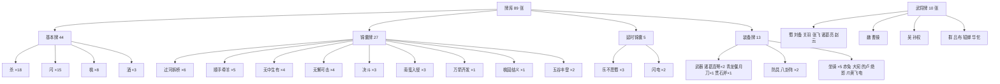
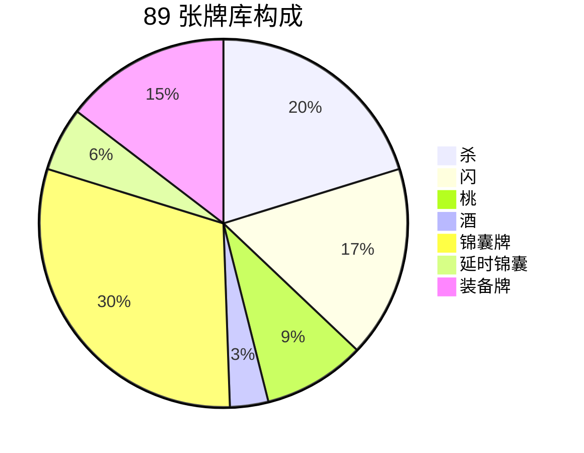
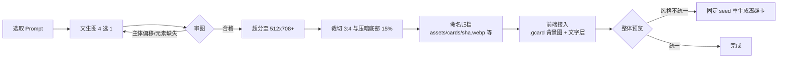

# 三国杀 · 群雄逐鹿 —— 卡牌文生图 Prompt 手册

> **用途**：为游戏内全部卡牌生成统一风格的 AI 插画，替换当前的字牌面，做一次视觉升级。
> **用法**：每张卡给出「效果速览 → 画面意象 → 英文 Prompt」。Prompt 采用"主体 + 氛围 + 全局风格后缀"三段式，保证整套牌面风格一致。
> **建议**：英文 Prompt 在 Midjourney / Stable Diffusion / DALL·E / 即梦等模型上效果更稳；中文模型可直接翻译使用。

---

## 一、统一风格规范

### 1. 全局风格后缀（每条 Prompt 末尾必须拼接）

```text
STYLE_SUFFIX =
ancient Chinese Three Kingdoms era card game illustration, ink-wash painting
blended with fine gongbi line art, dark lacquered background with aged parchment
texture, ornate gold filigree border, dramatic rim lighting, rich vermilion and
antique gold palette, highly detailed, centered composition, vertical portrait
```

### 2. 全局负面提示词（Negative Prompt）

```text
NEGATIVE =
text, watermark, signature, logo, frame with letters, modern objects, photography,
3d render, anime chibi, western fantasy, low quality, blurry, deformed hands,
extra fingers, oversaturated, flat colors
```

### 3. 出图参数建议

| 参数 | 建议值 | 说明 |
|------|--------|------|
| 比例 | `--ar 3:4`（MJ）/ 768×1024（SD） | 与游戏内卡牌 108×150 的竖版比例一致 |
| 放大 | 生成后超分至 512×708 以上 | 保证 retina 屏清晰 |
| 多样性 | 每张生成 4 选 1 | 挑选构图最居中、主体最完整的一张 |
| 一致性 | 同类牌使用相同 seed 起点（SD） | 如全部"杀"用同一 seed 微调 |

### 4. 卡面构图规范（所有卡统一）

```text
中心 70%：主体插画（下文各卡描述）
左上角：不绘制任何文字（游戏 UI 会叠加花色点数）
底部 15%：留出暗部渐变（游戏 UI 会叠加牌名）
边框：统一鎏金缠枝纹细框
```

---

## 二、牌库总览

### 牌库分类树



### 牌库数量分布



### 花色说明

同一卡牌的不同花色（♠♥♣♦）**共用同一张插画**——游戏内花色与点数由 UI 层叠加渲染，无需按花色分别出图。

---

## 三、基本牌（4 种 · 44 张）

### 3.1 杀 ×18

- **效果**：对攻击范围内一名角色造成 1 点伤害
- **意象**：出鞘的瞬间——一道凌厉的刀光剑气斜劈而下

```text
PROMPT =
a fierce broadsword slash cutting through the air with a crescent of crimson
sword energy, sparks and ink splashes flying, dynamic diagonal composition,
{STYLE_SUFFIX}
```

### 3.2 闪 ×15

- **效果**：抵消一张【杀】
- **意象**：银色残影侧身格挡，刀锋擦身而过的刹那

```text
PROMPT =
a silver-clad warrior silhouette dodging with a glowing parry streak, elegant
deflecting motion with moonlight-blue energy arc, motion blur afterimage,
{STYLE_SUFFIX}
```

### 3.3 桃 ×8

- **效果**：回复 1 点体力，或救濒死者
- **意象**：一颗仙桃坠于玉盘，粉色花瓣环绕，生机流转

```text
PROMPT =
a single luminous immortal peach resting on a jade plate, soft pink petals
drifting around, gentle green healing aura, spring blossom atmosphere,
{STYLE_SUFFIX}
```

### 3.4 酒 ×3

- **效果**：本回合下一张【杀】伤害 +1；或濒死自救
- **意象**：青铜酒樽中酒液翻涌，酒气化作红色战意升腾

```text
PROMPT =
an ancient bronze wine vessel with surging rice wine, crimson warrior spirit
rising from the splashing wine like flame, fierce bravado atmosphere,
{STYLE_SUFFIX}
```

---

## 四、锦囊牌（9 种 · 27 张）

### 4.1 过河拆桥 ×6

- **效果**：弃置一名其他角色的一张牌
- **意象**：木桥自中央断裂，两截坠落激流

```text
PROMPT =
an old wooden bridge breaking apart at its center, two halves collapsing into
a rushing river below, splashing water and drifting planks, cunning destruction
mood, {STYLE_SUFFIX}
```

### 4.2 顺手牵羊 ×5

- **效果**：获得距离 1 以内一名角色的一张牌
- **意象**：广袖之中一只手悄然而出，取走卷轴，羊形玉佩点缀暗喻"牵羊"

```text
PROMPT =
a stealthy hand emerging from a flowing silk sleeve snatching an ancient scroll,
a subtle jade goat ornament glowing in the shadow, espionage atmosphere,
{STYLE_SUFFIX}
```

### 4.3 无中生有 ×4

- **效果**：摸两张牌
- **意象**：双掌之间金光凝聚，化作两张虚影卡牌

```text
PROMPT =
a pair of open palms conjuring golden light between them, two glowing ghostly
cards materializing from swirling magic particles, mystery and creation mood,
{STYLE_SUFFIX}
```

### 4.4 无懈可击 ×4

- **效果**：抵消一张锦囊牌的效果
- **意象**：一面八卦光盾将袭来的暗器尽数弹开

```text
PROMPT =
a translucent bagua energy shield deflecting a volley of incoming dark
projectiles, radiant defensive barrier with reverberating light ripples,
impregnable defense mood, {STYLE_SUFFIX}
```

### 4.5 决斗 ×3

- **效果**：与目标轮流出【杀】，未出者受 1 点伤害
- **意象**：两名武将阵前单挑，双刃相交迸出火星

```text
PROMPT =
two ancient Chinese warriors clashing blades in a duel, sparks exploding at the
crossing point of sword and glaive, dust swirling beneath their feet, heroic
confrontation, {STYLE_SUFFIX}
```

### 4.6 南蛮入侵 ×3

- **效果**：所有其他角色需出【杀】，否则受 1 点伤害
- **意象**：南蛮象兵与藤甲军咆哮冲锋，烟尘蔽日

```text
PROMPT =
a horde of southern barbarian war elephants and rattan-armored tribesmen
charging forward, dust clouds and war drums, savage invasion momentum,
{STYLE_SUFFIX}
```

### 4.7 万箭齐发 ×1

- **效果**：所有其他角色需出【闪】，否则受 1 点伤害
- **意象**：漫天箭雨遮蔽天空，如暴雨倾泻

```text
PROMPT =
countless arrows filling the entire sky like a black rainstorm descending,
silhouetted archers firing in unison from below, overwhelming barrage,
{STYLE_SUFFIX}
```

### 4.8 桃园结义 ×1

- **效果**：所有角色回复 1 点体力
- **意象**：桃花纷落的园林中三炷清香、三只酒碗，义气冲天

```text
PROMPT =
three incense sticks and three wine bowls in a blossoming peach garden,
petals falling gently, sworn brotherhood ceremony with warm golden light,
solemn and heartfelt, {STYLE_SUFFIX}
```

### 4.9 五谷丰登 ×2

- **效果**：亮出等同人数的牌，每人选一张
- **意象**：金色谷仓前五谷堆叠，稻穗饱满，惠泽众人

```text
PROMPT =
a golden harvest scene with stacked grain sheaves and overflowing rice sacks,
abundant wheat ears in the foreground, bountiful blessing atmosphere with warm
sunlight, {STYLE_SUFFIX}
```

---

## 五、延时锦囊（2 种 · 5 张）

### 5.1 乐不思蜀 ×3

- **效果**：判定非红桃则跳过出牌阶段
- **意象**：宫廷烛影中歌舞升平，一位君主沉溺酒色忘了归途

```text
PROMPT =
a decadent palace chamber with dancing silhouettes and flickering candles,
an entranced lord slumping on a throne surrounded by silk drapes and wine cups,
bewitching indulgence mood, {STYLE_SUFFIX}
```

### 5.2 闪电 ×2

- **效果**：判定黑桃则受 3 点雷电伤害，否则移给下家
- **意象**：紫电自乌云中劈落，缠绕古老战场

```text
PROMPT =
a colossal purple lightning bolt striking down from storm clouds onto an
ancient battlefield, electric arcs crawling across the ground, apocalyptic
thunderstorm, {STYLE_SUFFIX}
```

---

## 六、装备牌（10 种 · 13 张）

### 6.1 武器

#### 诸葛连弩 ×2

- **效果**：出牌阶段【杀】无次数限制
- **意象**：机关连弩特写，弩匣中箭矢密布

```text
PROMPT =
an intricate repeating crossbow mechanism with a magazine of loaded bolts,
close-up of wooden and bronze engineering details, Zhuge Liang invention
aesthetic, {STYLE_SUFFIX}
```

#### 青龙偃月刀 ×1

- **效果**：攻击范围 3；【杀】被闪后可追杀
- **意象**：青龙缠绕的偃月大刀立于月光下，刀刃寒芒

```text
PROMPT =
a massive guandao glaive with an emerald dragon coiling around its blade,
moonlight glinting on the crescent edge, mythical weapon aura,
{STYLE_SUFFIX}
```

#### 贯石斧 ×1

- **效果**：攻击范围 3；被闪后可弃两张牌强行命中
- **意象**：一柄巨斧劈开巨石，碎石飞溅

```text
PROMPT =
a colossal battle axe splitting a giant boulder in half, rock debris and dust
exploding outward, brutal crushing force, {STYLE_SUFFIX}
```

### 6.2 防具

#### 八卦阵 ×2

- **效果**：需要【闪】时可判定，红色视为闪
- **意象**：悬空的八卦罗盘阵法，符文流转

```text
PROMPT =
a floating bagua compass array with eight trigram symbols rotating in mid-air,
golden runes and mist swirling around the formation, mystical taoist magic,
{STYLE_SUFFIX}
```

### 6.3 坐骑（-1 进攻马 ×2 / +1 防御马 ×3）

#### 赤兔 ×1（进攻马）

- **效果**：计算与其他角色的距离 -1
- **意象**：火红神驹腾空嘶鸣，鬃毛如焰

```text
PROMPT =
a legendary crimson stallion rearing and neighing, mane flowing like flames,
fire and embers trailing its hooves, peerless steed aura, {STYLE_SUFFIX}
```

#### 大宛 ×1（进攻马）

- **效果**：计算距离 -1
- **意象**：西域汗血宝马疾驰，尘沙飞扬

```text
PROMPT =
a mighty western regions warhorse galloping at full speed across desert sand,
sweat like blood on its glossy coat, sandstorm trailing behind,
{STYLE_SUFFIX}
```

#### 的卢 ×1（防御马）

- **效果**：其他角色计算与你的距离 +1
- **意象**：额生白斑的黑马昂首而立，护主之势

```text
PROMPT =
a powerful black horse with a distinctive white blaze on its forehead standing
guard with a protective stance, loyal guardian aura, {STYLE_SUFFIX}
```

#### 绝影 ×1（防御马）

- **效果**：其他角色计算与你的距离 +1
- **意象**：快如鬼魅的黑影骏马，身形半虚化

```text
PROMPT =
a phantom black stallion running so fast its body partially dissolves into
shadow and mist, afterimage streaks, elusive shadow steed, {STYLE_SUFFIX}
```

#### 爪黄飞电 ×1（防御马）

- **效果**：其他角色计算与你的距离 +1
- **意象**：通体金黄的白蹄宝马踏电而行

```text
PROMPT =
a golden-haired imperial horse with white hooves galloping on lightning,
royal yellow coat gleaming, electric sparks under its hooves,
{STYLE_SUFFIX}
```

---

## 七、武将牌（10 张）

> 武将牌插画建议：**半身像构图**（胸部以上，微微侧身回眸），顶部留白给姓名区，底部留给技能区。

### 蜀

**刘备 · 仁德**

```text
PROMPT =
a benevolent warlord in dual-sword regalia with kind determined eyes, silk
robes of deep blue, half-body portrait with subtle warm smile, charismatic
leadership aura, {STYLE_SUFFIX}
```

**关羽 · 武圣**

```text
PROMPT =
a red-faced majestic general with a long flowing beard, green robe and jade
belt, holding his guandao glaive, piercing loyal eyes, half-body portrait,
{STYLE_SUFFIX}
```

**张飞 · 咆哮**

```text
PROMPT =
a fierce black-faced warrior with leopard-like round glaring eyes, wild beard,
gripping a long serpent spear, roaring with thunderous fury, half-body portrait,
{STYLE_SUFFIX}
```

**诸葛亮 · 空城**

```text
PROMPT =
a serene strategist in a scholar robe holding a crane feather fan, calm
piercing wisdom in his eyes, sitting composed before an empty fortress gate,
half-body portrait, {STYLE_SUFFIX}
```

**赵云 · 龙胆**

```text
PROMPT =
a handsome young general in silver-white armor with a flowing cape, holding a
slender spear, valiant and graceful, dragon energy swirling around,
half-body portrait, {STYLE_SUFFIX}
```

### 魏

**曹操 · 奸雄**

```text
PROMPT =
a cunning overlord with sharp hawk-like eyes and a thin beard, dark armor with
crimson accents, subtle sinister smile, calculating ambition aura,
half-body portrait, {STYLE_SUFFIX}
```

### 吴

**孙权 · 制衡**

```text
PROMPT =
a young emperor with purple beard and jade-green eyes, golden imperial robes,
holding a balance scale of state affairs in his gaze, composed authority,
half-body portrait, {STYLE_SUFFIX}
```

### 群

**吕布 · 无双**

```text
PROMPT =
the mightiest warrior with pheasant-tail feathers on his golden headdress,
armored in black and gold, wielding a halberd atop a red steed silhouette,
arrogant invincible aura, half-body portrait, {STYLE_SUFFIX}
```

**貂蝉 · 离间**

```text
PROMPT =
a breathtakingly beautiful court lady in flowing pink and white silk,
delicate hairpins and jade ornaments, enigmatic smile hiding scheming intent,
moonlit garden, half-body portrait, {STYLE_SUFFIX}
```

**华佗 · 急救**

```text
PROMPT =
a gentle elderly physician in plain green robes carrying a medicine gourd and
silk medical scrolls, kind wise eyes, healing herbs floating around,
half-body portrait, {STYLE_SUFFIX}
```

---

## 八、生成工作流



## 九、接入游戏

1. 生成图统一放入 `assets/cards/`（建议 webp，单张 ≤ 80KB）
2. `js/fx.js` 的 `cardInnerHTML()` 中，将中央 `.face` 文字替换为 `<div class="face-art" style="background-image:url(assets/cards/<key>.webp)">`，保留左上角花色点数与底部牌名的文字层（叠在插画暗部上，保证可读）
3. 武将头像同理替换 `hero-portrait` 的首字大字，保留姓名/技能的 DOM 结构
4. 建议保留当前字牌面作为**低画质回退**：图片加载失败时 `.face-art` 显示原文字

---

*牌数统计：卡牌 24 种 89 张 + 武将 10 张 = 34 条 Prompt。*
